# 主页

## 页面

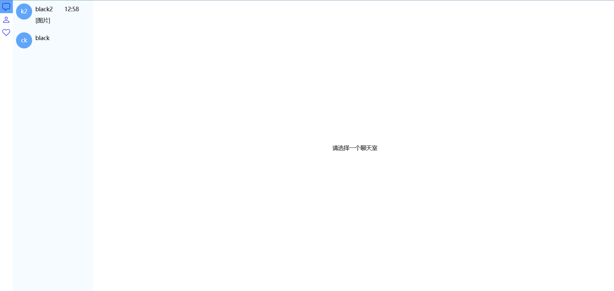

## 视图导航

如上图，包含聊天页（包含聊天列表和聊天内容主视图）、联系人页、收藏页。

## 各页面功能

### 联系人页

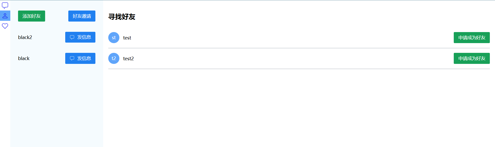

功能：

- 左侧列表展示当前用户的联系人
- 左侧上方含有添加好友、好友邀请
- 点击添加好友时，右侧主视图显示可邀请的陌生人列表，如上图所示；点击“申请成为好友”，会弹出填写申请理由的弹框（见下图“申请理由”）
- 若用户有未应答的好友邀请，“好友邀请”按钮会显示红点（见下图“邀请红点”），会展示邀请列表（见下图“好友邀请列表”），每一项邀请可以选择接受或拒绝；若没有邀请，会弹出提示（见下图“暂无受邀”）；

申请理由：

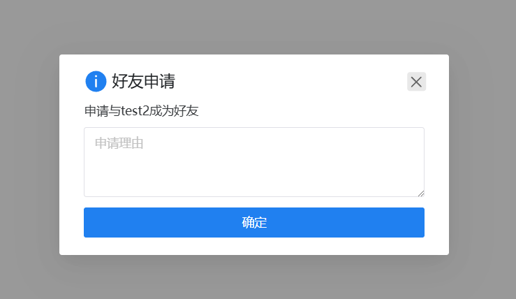

邀请红点：

好友邀请列表：

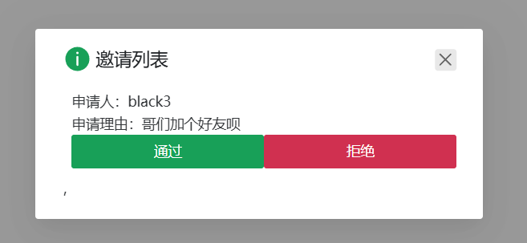

暂无受邀：

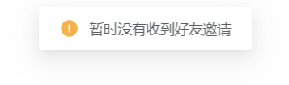

### 聊天页

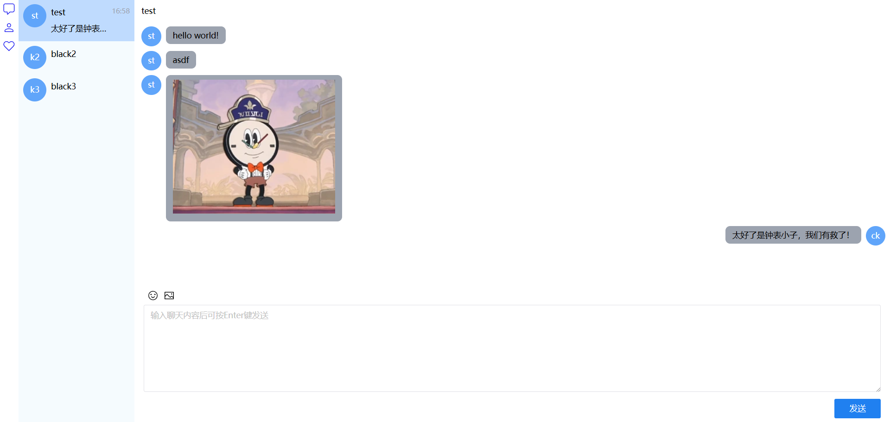

功能：

- 左侧是聊天室列表，按更新时间倒序排列，内容包含房间名（单聊时是对方的用户名）、最新消息的时间、最新消息的内容（超过最大长度显示省略）。
- 右侧是聊天主视图，显示聊天记录和输入控件。输入控件支持输入颜文字和发送图片。颜文字的输入示例见下图“输入和显示颜文字”，发送图片的实例见下图“发送图片”。
- 当聊天记录有新消息，且当前视图没有滚动到最下方时，左边聊天室会出现红点，右侧也会出现点击后能滚动到最下方的滑块（见下图“接收新消息”）。
- 聊天记录会缓存在IndexedDB中，后序打开某个聊天室，如果有记录，会请求自这个记录后的消息记录，减小响应体，加快加载过程。
- 另外，当前聊天室有新消息时，同一个聊天室的对象能马上收到消息（见下图“实时通信”）。可通过开两个窗口，分别登录账号后发送消息尝试。
- 右键单击某条消息，会弹出popup（见下图“添加收藏”），点击收藏，能把某条消息添加到自己的收藏，收藏列表在收藏页面。

接受新消息：

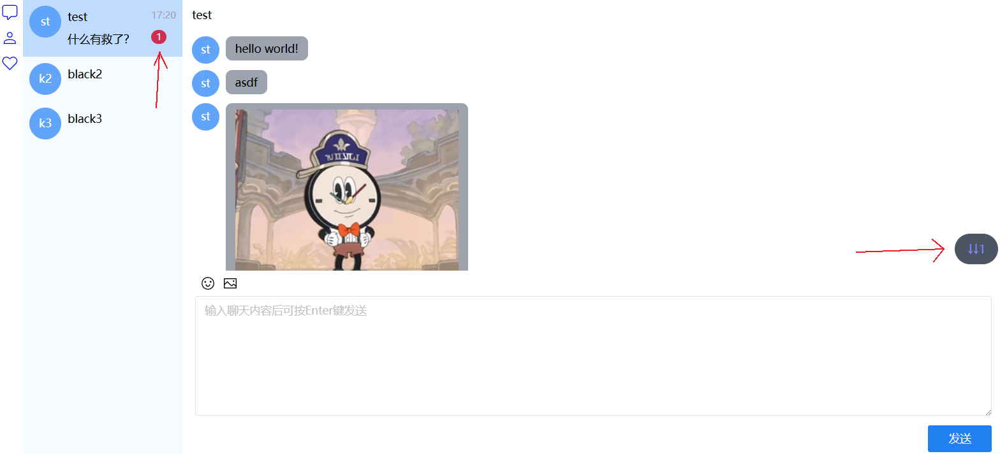

输入和显示颜文字：

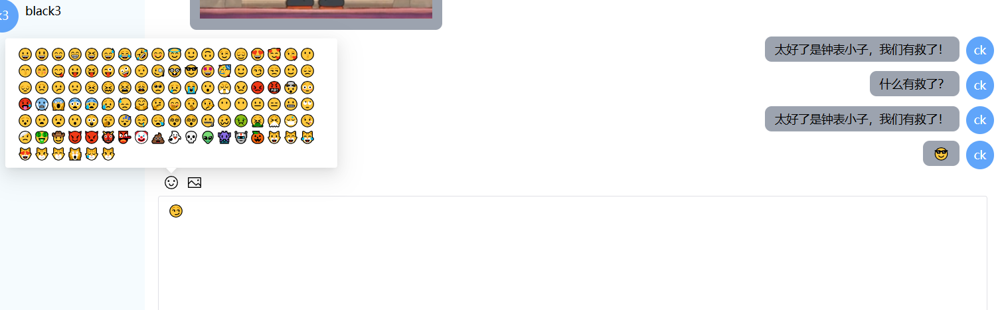

发送图片：

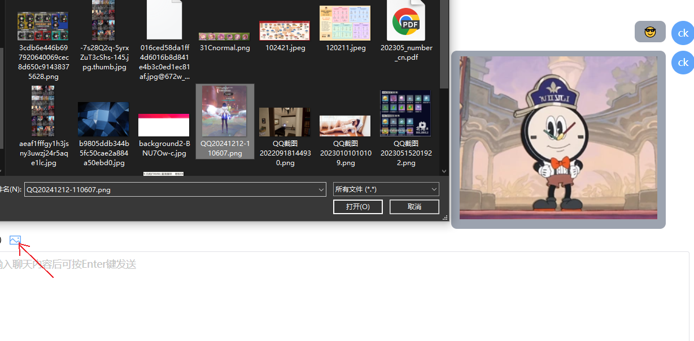

实时通信：

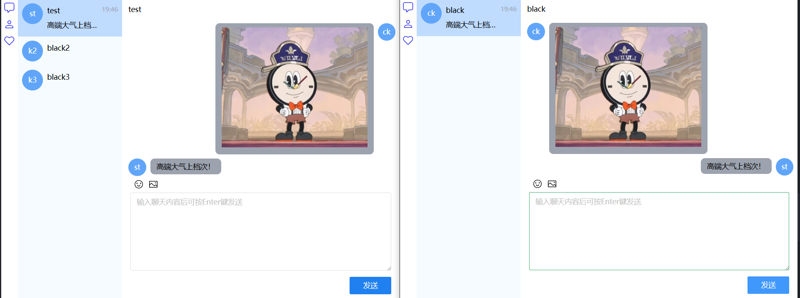

添加收藏：

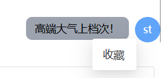

### 收藏页

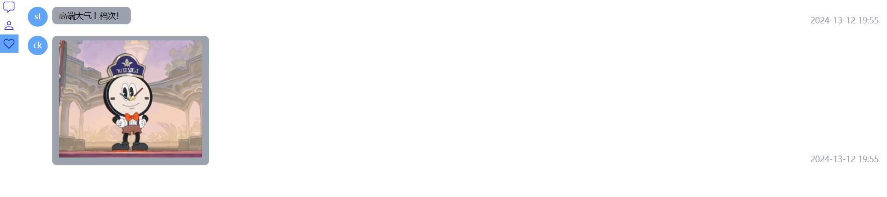

功能：

- 右键点击某条收藏消息，能取消收藏，并刷新列表。

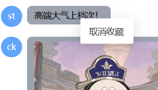
